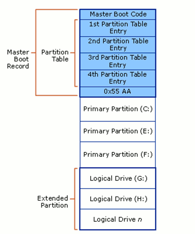

<H3>Master Boot Record (MBR)</H3>

MBR is the old standard for managing the partition in the hard disk, and it is still being used extensively by many people. The MBR resides at the very beginning of the hard disk and it holds the information on how the logical partitions are organized in the storage device. In addition, the MBR also contains executable code that can scan the partitions for the active OS and load up the boot up code/procedure for the OS.

For a MBR disk, you can only have four primary partitions. To create more partitions, you can set the fourth partition as the extended partition and you will be able to create more sub-partitions (or logical drives) within it. As MBR uses 32-bit to record the partition, each partition can only go up to a maximum of 2TB in size. This is how a typical MBR disk layout looks like:

There are several pitfalls with MBR. First of all, you can only have 4 partitions in the hard disk and each partition is limited to only 2TB in size. This is not going to work well with hard disk of big storage space, say 100TB. Secondly, the MBR is the only place that holds the partition information. If it ever get corrupted (and yes, it can get corrupted very easily), the entire hard disk is unreadable.
